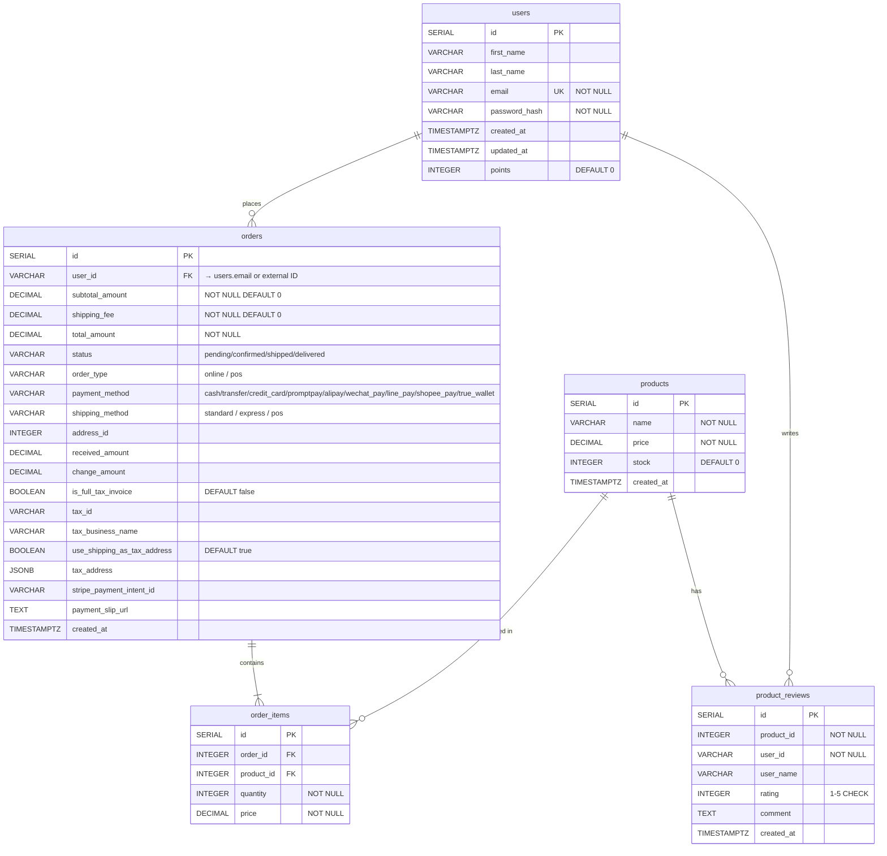
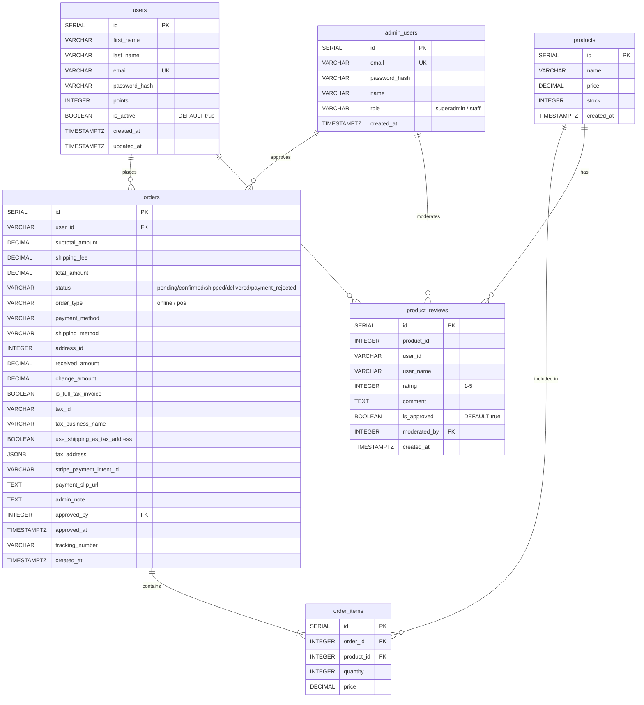

# 🍷 The Bottle Club — Project Documentation

โครงการร้านค้าออนไลน์สำหรับเครื่องดื่ม (Wine & Spirits) พัฒนาด้วย **Next.js 16** (Frontend) และ **Express.js** (Backend) โดยใช้ฐานข้อมูล **PostgreSQL** และเชื่อมต่อกับ External API แบบ Hybrid System

---

## 📐 Web Inspection (สถาปัตยกรรมเว็บ)

### Architecture Overview

```
┌─────────────────────────────────────────────────────────────────┐
│                        CLIENT BROWSER                           │
│   React 19 + Next.js 16 App Router + Tailwind CSS v4           │
└──────────────────────┬──────────────────────────────────────────┘
                       │  HTTP / HTTPS
          ┌────────────▼────────────┐
          │   NEXT.JS FRONTEND      │  :3000
          │   (App Router / SSR)    │
          │                         │
          │  ┌───────────────────┐  │
          │  │  Pages (Routes)   │  │
          │  │  /               │  │
          │  │  /product/[id]   │  │
          │  │  /cart           │  │
          │  │  /checkout       │  │
          │  │  /auth/*         │  │
          │  │  /account/*      │  │
          │  │  /search         │  │
          │  │  /tracking       │  │
          │  └───────────────────┘  │
          │                         │
          │  ┌───────────────────┐  │
          │  │  API Routes       │  │
          │  │  /api/products    │  │
          │  │  /api/reviews     │  │
          │  │  /api/shipping    │  │
          │  │  /api/proxy/*     │  │
          │  │  /api/customers/* │  │
          │  │  /api/create-order│  │
          │  └───────────────────┘  │
          └──────────┬──────────────┘
                     │
         ┌───────────┼───────────┐
         │           │           │
         ▼           ▼           ▼
┌──────────────┐ ┌──────────┐ ┌──────────────────┐
│  PostgreSQL  │ │ Express  │ │  External API     │
│  Database   │ │ Backend  │ │  possimon.onrender │
│             │ │  :3001   │ │  .com             │
│  - users    │ │          │ │                   │
│  - orders   │ │  Stripe  │ │  - /api/wines     │
│  - order_   │ │  Webhooks│ │  - /reviews       │
│    items    │ │  Shipping│ │  - Auth Endpoints │
│  - products │ │  API     │ │  - Address Book   │
│  - product_ │ └──────────┘ └──────────────────┘
│    reviews  │
└─────────────┘
```

### 📄 Pages & Routes

| Route | ประเภท | คำอธิบาย |
|-------|--------|----------|
| `/` | SSR | หน้าหลัก — Hero banner + ProductGrid พร้อม Members-Only Barrier |
| `/product/[id]` | SSR + ISR | รายละเอียดสินค้า + Related Products Carousel + Reviews |
| `/cart` | Client | ตะกร้าสินค้า — คำนวณ VAT 7% + Reward Points |
| `/checkout` | Client | ชำระเงิน — Stripe, PromptPay, Cash ฯลฯ |
| `/checkout/confirmation` | Client | หน้ายืนยันคำสั่งซื้อ |
| `/confirm-payment` | Client | ยืนยันการชำระเงินผ่าน Stripe Webhook |
| `/auth/login` | Client | เข้าสู่ระบบ |
| `/auth/register` | Client | สมัครสมาชิก |
| `/account` | SSR | โปรไฟล์ผู้ใช้ (Protected) |
| `/account/profile` | Client | แก้ไขข้อมูลส่วนตัว |
| `/account/orders` | Client | ประวัติคำสั่งซื้อ |
| `/account/addresses` | Client | จัดการที่อยู่จัดส่ง |
| `/account/points` | Client | คะแนนสะสม |
| `/account/reviews` | Client | รีวิวสินค้าของฉัน |
| `/account/privacy` | Client | นโยบายความเป็นส่วนตัว |
| `/search` | Client | ค้นหาสินค้า |
| `/tracking` | Client | ติดตามพัสดุ |

### 🔌 API Routes (Next.js Internal)

| Method | Endpoint | คำอธิบาย |
|--------|----------|----------|
| GET | `/api/products` | Proxy ดึงรายการสินค้าจาก External API |
| GET/POST | `/api/reviews` | CRUD รีวิวสินค้า → Local DB |
| GET | `/api/shipping/track` | ติดตามพัสดุ (External + Built-in Fallback) |
| POST | `/api/shipping/track` | ติดตามพัสดุผ่าน Body Params |
| ANY | `/api/proxy/*` | Reverse Proxy ไปยัง External API |
| GET/POST | `/api/customers/addresses` | จัดการที่อยู่ → External API |
| POST | `/api/create-order` | สร้างคำสั่งซื้อ → Local DB + External |

### 🧩 Component Tree

```
RootLayout
├── LanguageProvider (Context — 25+ ภาษา)
├── SessionSync (Client — Hydrate Auth State)
├── Header
│   ├── MainHeader (Logo + Search + Cart Icon)
│   └── MobileNav (Hamburger Menu)
├── [Page Content]
│   ├── Hero (หน้าแรก)
│   ├── ProductGrid → ProductCard
│   ├── MembersOnlyBarrier (บล็อกราคา/รูปสำหรับ Guest)
│   ├── ProductDetailClient → Review Section + Related Carousel
│   ├── SearchProductList
│   └── [Account Pages] → Profile / Orders / Address / Points / Reviews
├── AIChat (Floating AI Assistant)
├── VoiceAssistant (Floating Voice Assistant)
└── Footer
```

### 🔐 Authentication Flow

```
User Login/Register
       │
       ▼
External API (possimon.onrender.com)
       │  JWT Token
       ▼
Next.js Server Action (login())
       │  encrypt() with jose / HS256
       ▼
HttpOnly Cookie "session" (2h TTL)
       │
       ▼
Middleware (updateSession) — Auto-refresh
       │
       ▼
getSession() → Server Components / API Routes
```

### 🌐 Tech Stack

| Layer | Technology | Version |
|-------|-----------|---------|
| Frontend Framework | Next.js | 16.2.4 |
| UI Library | React | 19.2.4 |
| Language | TypeScript | ^5 |
| Styling | Tailwind CSS | ^4 |
| Animation | Framer Motion | ^12 |
| Icons | Lucide React | ^1.11 |
| Auth | jose (JWT Sign/Verify) | ^6.2 |
| Payments | Stripe | ^22.1 |
| Database Client | pg (node-postgres) | ^8.20 |
| State Management | Zustand | ^5 |
| Maps | Leaflet + React-Leaflet | ^5 |
| Backend | Express.js | — |
| Database | PostgreSQL | — |
| Fonts | Inter + Playfair Display | Google Fonts |

---

## 🗄️ ER Diagram (Entity Relationship Diagram)



### 📊 ความสัมพันธ์ระหว่างตาราง

| ความสัมพันธ์ | ประเภท | คำอธิบาย |
|-------------|--------|----------|
| `users` → `orders` | One-to-Many | ผู้ใช้หนึ่งคนมีได้หลายคำสั่งซื้อ |
| `orders` → `order_items` | One-to-Many | คำสั่งซื้อหนึ่งมีหลายรายการสินค้า |
| `products` → `order_items` | One-to-Many | สินค้าหนึ่งรายการมีได้ในหลายออเดอร์ |
| `products` → `product_reviews` | One-to-Many | สินค้าหนึ่งชิ้นมีได้หลายรีวิว |
| `users` → `product_reviews` | One-to-Many | ผู้ใช้หนึ่งคนเขียนรีวิวได้หลายชิ้น |

> **หมายเหตุ**: `orders.user_id` เป็น `VARCHAR` เพื่อรองรับทั้ง Local DB user (integer as string) และ External API user ID (UUID/string) แบบ Hybrid System

---

## 🌟 ฟีเจอร์ที่พัฒนาแล้ว (Implemented Features)

### 🔐 ระบบสมาชิกและความปลอดภัย (Authentication & Security)
- **ระบบ Login / Register**: เชื่อมต่อ External API พร้อมระบบตรวจสอบข้อผิดพลาดครบถ้วน รองรับทั้ง Username และ Email
- **Advanced JWT Handling**: Extract & Normalize Token อัตโนมัติจาก API Payload หลายรูปแบบ, `setSessionFromToken`
- **Secure Session Management**: Cookie-based Session ด้วย `jose` (Sign/Verify HS256) — HttpOnly, Secure, SameSite=Lax
- **Middleware Protection**: Auto-refresh session + Route protection สำหรับหน้าที่ต้องระบุตัวตน
- **Members-Only Barrier**: ซ่อนราคา/รูปสินค้าจริงสำหรับ Guest เพื่อกระตุ้นการสมัครสมาชิก

### 👤 การจัดการบัญชี (Account Management)
- **Unified Profile**: แสดงและแก้ไขข้อมูลส่วนตัวแบบรวมศูนย์
- **Address Book**: CRUD ที่อยู่จัดส่งผ่าน API Proxy → External System
- **Order History**: ดึงข้อมูลจาก External API พร้อม Fallback บันทึกลง Local DB
- **Points & Rewards**: ระบบคะแนนสะสมสำหรับสมาชิก
- **Review Management**: เขียน/ดูรีวิวสินค้าของตัวเอง

### 🍷 ระบบแสดงและจัดการสินค้า (Product Catalog)
- **Hybrid Data Fetching**: ดึงสินค้าจาก External API + Fallback Mock Data
- **Smart Product Mapping**: แปลง Raw API data → Standard Schema พร้อม Auto-color Tagging (Red/White/Rose) และ Country Mapping (ISO Code)
- **Dynamic Product Detail**: SSR + ISR รองรับ Next.js 15+ dynamic params
- **Related Products Carousel**: แสดงสินค้าที่เกี่ยวข้องพร้อม Quick Buy
- **Advanced Search**: ค้นหาตาม ชื่อ, ประเภท, สายพันธุ์, ภูมิภาค

### 🛒 ตะกร้าและการชำระเงิน (Cart & Checkout)
- **Cart State**: Zustand + localStorage persistence พร้อม Server-Client Sync
- **VAT Calculation**: คำนวณ VAT 7% + แสดง Reward Points ที่จะได้รับ
- **Multi-payment Methods**: Stripe, PromptPay, Transfer, Cash, AliPay, WeChat Pay, LINE Pay, ShopeePay, TrueMoney Wallet
- **Tax Invoice**: รองรับการออกใบกำกับภาษีเต็มรูปแบบ (TAX ID + ที่อยู่)
- **Stripe Integration**: Checkout Sessions + Payment Intents + Webhooks (backend)

### 🚚 ระบบขนส่ง (Shipping & Tracking)
- **Multi-modal Tracking**: รองรับทางอากาศ (AIR), ทางเรือ (SEA), ในประเทศ (DOM)
- **Multi-destination**: ส่งออกไปได้หลายประเทศ (JP, GB, CN, RU, TH ฯลฯ)
- **External API Integration**: เชื่อม Shipping API ภายนอกพร้อม Built-in Fallback
- **Interactive Map**: แสดงเส้นทางการขนส่งด้วย Leaflet Map

### 🤖 AI & Voice Assistant
- **AIChat**: Floating AI Chatbot ช่วยแนะนำสินค้าและตอบคำถาม
- **VoiceAssistant**: Floating Voice Assistant ควบคุมเว็บด้วยเสียง

### 🌍 ระบบหลายภาษา (Localization)
- รองรับ **25+ ภาษา**: TH, EN, FR, ZH, JA, ES, DE, KO, IT, RU, PT, VI, AR, HI, ID, TR, NL, PL, SV, DA, NO, FI, MS, HE, EL
- **RTL Support**: ภาษาอาหรับ (AR) และ ฮีบรู (HE)
- **Hydration-safe**: ใช้ `useSyncExternalStore` + Server-side `Accept-Language` detection
- **Persistent**: บันทึกการเลือกภาษาลง `localStorage` อัตโนมัติ

---

## ✅ อัปเดตล่าสุด (Latest Updates)

### 📋 Session — 2026-06-04 (ล่าสุด)
- **Web Inspection & ER Diagram**: เพิ่มเอกสาร Architecture, Route Map, Component Tree, และ ER Diagram ใน README

### 📋 Session — 2026-05-23
- **Hydration Fix**: แก้ Hydration Mismatch ใน `ProductGrid.tsx` ด้วย `useSyncExternalStore`
- **Product Infrastructure**: อัปเดต `getProducts` รองรับ Bearer Token Authentication
- **Dynamic Routing Fix**: แก้ Dynamic Params สำหรับ `/product/[id]` บน Next.js 15+

### 📋 Session — 2026-05-18
- **Localization Expansion**: เพิ่มคีย์แปลภาษาสำหรับ Cart + Checkout ครอบคลุม 10+ ภาษา
- **Enhanced Cart UI**: Redesign ตะกร้าสินค้า + คำนวณ VAT 7% + Reward Points
- **Product Visibility**: Conditional Rendering — สมาชิกเห็นรูปจริง / Guest เห็น Silhouette
- **Stripe Update**: อัปเดต API Version เป็น `2023-10-16`

### 📋 Session — 2026-05-17
- **Related Products Carousel**: เพิ่ม Horizontal Carousel + Quick Buy ในหน้า Product Detail
- **VAT Formula Fix**: เปลี่ยนตัวแปร `tax` → `vat`, สูตร `total = subtotal + vat`
- **Account 404 Fix**: แก้ปัญหาหน้า `/account` แสดง 404 หลัง Dev Server Restart

---

## 🛠️ เทคโนโลยีที่ใช้ (Tech Stack)

| ส่วน | เทคโนโลยี |
|------|-----------|
| **Frontend** | Next.js 16.2.4 (App Router), React 19, TypeScript 5 |
| **Styling** | Tailwind CSS v4, Framer Motion |
| **Backend** | Node.js, Express.js (Stripe & Shipping) |
| **Database** | PostgreSQL + pg pool |
| **Auth** | JWT via `jose`, HttpOnly Cookies |
| **Payments** | Stripe (Checkout, Webhooks) |
| **Maps** | Leaflet + React-Leaflet |
| **State** | Zustand + localStorage |
| **Icons** | Lucide React |
| **Fonts** | Inter + Playfair Display (Google Fonts) |

---

## 🚀 วิธีการติดตั้ง (Installation)

### 1. โคลนโปรเจกต์
```bash
git clone https://github.com/artisan-digital-asia/Project1-ThebottleClub.git
cd Project1-ThebottleClub
```

### 2. ตั้งค่า Frontend
```bash
cd frontend
npm install
```
สร้างไฟล์ `.env.local` ในโฟลเดอร์ `frontend`:
```env
DATABASE_URL=your_postgresql_connection_string
JWT_SECRET=your_jwt_secret
NEXT_PUBLIC_API_URL=https://possimon.onrender.com
NEXT_PUBLIC_STRIPE_PUBLISHABLE_KEY=your_stripe_publishable_key
STRIPE_SECRET_KEY=your_stripe_secret_key
# Optional: external shipping carrier API (falls back to built-in routes)
SHIPPING_API_URL=https://your-carrier-api.example.com
SHIPPING_API_KEY=your_shipping_api_key
```
รัน Frontend:
```bash
npm run dev
```

### 3. ตั้งค่า Backend (สำหรับ Stripe Checkout/Webhooks)
```bash
cd ../backend
npm install
```
สร้างไฟล์ `.env` ในโฟลเดอร์ `backend`:
```env
PORT=3001
STRIPE_SECRET_KEY=your_stripe_secret_key
SHIPPING_API_URL=https://your-carrier-api.example.com
SHIPPING_API_KEY=your_shipping_api_key
```
รัน Backend:
```bash
npm run dev
```

### 4. Shipping Tracking API

| Method | Endpoint | คำอธิบาย |
|--------|----------|----------|
| GET | `/api/shipping/track?tracking_number=TBC-EXP-AIR-JP-001` | Next.js Route (แนะนำ) |
| POST | `/api/shipping/track` | Body: `{ tracking_number, transport_mode, destination_country, direction }` |
| GET | `http://localhost:3001/api/shipping/track/:trackingNumber` | Express Backend |

ตัวอย่าง Tracking Numbers:
- **ส่งออก**: `TBC-EXP-SEA-CN-001`, `TBC-EXP-AIR-JP-001`, `TBC-EXP-AIR-GB-001`, `TBC-EXP-AIR-RU-001`
- **ในประเทศ**: `TBC-DOM-LOCAL-TH-001`

### 5. การเตรียมฐานข้อมูล
```bash
psql -U your_user -d your_database -f database_init.sql
```

---

## 📁 โครงสร้างโฟลเดอร์

```
Project1-ThebottleClub/
├── frontend/                    # Next.js App
│   └── src/
│       ├── app/                 # App Router Pages & API Routes
│       │   ├── page.tsx         # หน้าหลัก
│       │   ├── product/[id]/    # รายละเอียดสินค้า
│       │   ├── cart/            # ตะกร้าสินค้า
│       │   ├── checkout/        # ชำระเงิน
│       │   ├── auth/            # Login / Register
│       │   ├── account/         # บัญชีผู้ใช้ (Protected)
│       │   ├── search/          # ค้นหา
│       │   ├── tracking/        # ติดตามพัสดุ
│       │   └── api/             # Internal API Routes
│       ├── components/          # React Components
│       ├── context/             # React Contexts (Language, etc.)
│       ├── lib/                 # Utilities (auth, cart, products, stripe)
│       └── utils/               # Helper Functions
├── backend/                     # Express.js Server
│   └── src/
│       ├── index.ts             # Main Server (Stripe + Shipping)
│       ├── db.ts                # DB Connection
│       └── shipping/            # Shipping Service
├── database_init.sql            # PostgreSQL Schema
└── README.md                    # This file
```

---

## 🔧 Admin Panel — Specification (Planned)

ระบบหลังบ้านสำหรับผู้ดูแลร้าน The Bottle Club โดยออกแบบให้ต่อยอดจากโครงสร้างที่มีอยู่แล้ว

---

### 🎯 เป้าหมาย

| เป้าหมาย | รายละเอียด |
|----------|-----------|
| **จัดการออเดอร์** | อนุมัติสลิปโอนเงิน, เปลี่ยน status, พิมพ์ใบกำกับภาษี |
| **จัดการสินค้า** | เพิ่ม/แก้ไข/ลบสินค้าใน Local DB, sync กับ External API |
| **จัดการสมาชิก** | ดูข้อมูล user, ปรับคะแนน, ระงับบัญชี |
| **จัดการรีวิว** | อนุมัติ/ลบรีวิวที่ไม่เหมาะสม |
| **Dashboard** | ยอดขาย, สถิติ, รายงาน |
| **POS** | หน้าขาย ณ จุดขาย (Point of Sale) |

---

### 🗺️ Admin Routes (Planned)

| Route | คำอธิบาย | Priority |
|-------|----------|----------|
| `/admin` | Admin Login (แยกจาก User Login) | 🔴 High |
| `/admin/dashboard` | ภาพรวม — ยอดขายวันนี้, ออเดอร์ใหม่, สินค้าใกล้หมด | 🔴 High |
| `/admin/orders` | รายการออเดอร์ทั้งหมด + กรอง status | 🔴 High |
| `/admin/orders/[id]` | รายละเอียดออเดอร์ + อนุมัติสลิป + เปลี่ยน status | 🔴 High |
| `/admin/products` | จัดการสินค้า (CRUD) | 🔴 High |
| `/admin/products/new` | เพิ่มสินค้าใหม่ | 🟡 Medium |
| `/admin/products/[id]/edit` | แก้ไขสินค้า | 🟡 Medium |
| `/admin/members` | รายชื่อสมาชิกทั้งหมด | 🟡 Medium |
| `/admin/members/[id]` | โปรไฟล์สมาชิก + ปรับคะแนน + ประวัติออเดอร์ | 🟡 Medium |
| `/admin/reviews` | รีวิวสินค้าทั้งหมด + อนุมัติ/ลบ | 🟡 Medium |
| `/admin/pos` | หน้าขาย ณ จุดขาย (POS) | 🟢 Low |
| `/admin/reports` | รายงานยอดขาย, Export CSV/PDF | 🟢 Low |
| `/admin/settings` | ตั้งค่าร้าน (ค่าส่ง, VAT, Points Rate) | 🟢 Low |

---

### 🔌 Admin API Endpoints (Planned)

ทั้งหมดต้องผ่าน **Admin JWT Middleware** ก่อนทุก request

#### Orders
| Method | Endpoint | คำอธิบาย |
|--------|----------|----------|
| GET | `/api/admin/orders` | ดึงออเดอร์ทั้งหมด (paginate + filter by status/date) |
| GET | `/api/admin/orders/:id` | รายละเอียดออเดอร์ + items + slip URL |
| PATCH | `/api/admin/orders/:id/status` | เปลี่ยน status (pending → confirmed → shipped → delivered) |
| POST | `/api/admin/orders/:id/approve-payment` | อนุมัติสลิปโอนเงิน → set status `confirmed` |
| POST | `/api/admin/orders/:id/reject-payment` | ปฏิเสธสลิป → set status `payment_rejected` |

#### Products
| Method | Endpoint | คำอธิบาย |
|--------|----------|----------|
| GET | `/api/admin/products` | ดึงสินค้า Local DB ทั้งหมด (รวม stock) |
| POST | `/api/admin/products` | เพิ่มสินค้าใหม่ลง Local DB |
| PATCH | `/api/admin/products/:id` | แก้ไขสินค้า (ชื่อ, ราคา, stock) |
| DELETE | `/api/admin/products/:id` | ลบสินค้า (soft delete) |
| PATCH | `/api/admin/products/:id/stock` | ปรับ stock โดยตรง |

#### Members
| Method | Endpoint | คำอธิบาย |
|--------|----------|----------|
| GET | `/api/admin/users` | รายชื่อสมาชิกทั้งหมด + order count + points |
| GET | `/api/admin/users/:id` | โปรไฟล์ + ออเดอร์ของ user นี้ |
| PATCH | `/api/admin/users/:id/points` | ปรับคะแนนสะสม (เพิ่ม/ลด) |
| PATCH | `/api/admin/users/:id/status` | ระงับ/เปิดใช้บัญชี |

#### Reviews
| Method | Endpoint | คำอธิบาย |
|--------|----------|----------|
| GET | `/api/admin/reviews` | รีวิวทั้งหมด (filter by product/rating/status) |
| PATCH | `/api/admin/reviews/:id/approve` | อนุมัติรีวิว |
| DELETE | `/api/admin/reviews/:id` | ลบรีวิว |

#### Dashboard & Reports
| Method | Endpoint | คำอธิบาย |
|--------|----------|----------|
| GET | `/api/admin/dashboard` | ยอดขายวันนี้/เดือน, ออเดอร์ใหม่, สินค้าใกล้หมด |
| GET | `/api/admin/reports/sales` | รายงานยอดขายรายวัน/เดือน (query: `?from=&to=`) |
| GET | `/api/admin/reports/sales/export` | Export CSV |

---

### 🗄️ Database Changes (Planned)

ต้องเพิ่มตาราง/คอลัมน์ต่อไปนี้เข้า `database_init.sql`:

```sql
-- Admin users table (แยกจาก users ปกติ)
CREATE TABLE IF NOT EXISTS admin_users (
    id        SERIAL PRIMARY KEY,
    email     VARCHAR(255) UNIQUE NOT NULL,
    password_hash VARCHAR(255) NOT NULL,
    name      VARCHAR(255),
    role      VARCHAR(50) DEFAULT 'staff',  -- 'superadmin' | 'staff'
    created_at TIMESTAMPTZ DEFAULT NOW()
);

-- เพิ่มคอลัมน์ใน orders (สำหรับ Admin actions)
ALTER TABLE orders ADD COLUMN IF NOT EXISTS admin_note TEXT;
ALTER TABLE orders ADD COLUMN IF NOT EXISTS approved_by INTEGER REFERENCES admin_users(id);
ALTER TABLE orders ADD COLUMN IF NOT EXISTS approved_at TIMESTAMPTZ;
ALTER TABLE orders ADD COLUMN IF NOT EXISTS tracking_number VARCHAR(100);

-- เพิ่มคอลัมน์ใน product_reviews (สำหรับ Moderation)
ALTER TABLE product_reviews ADD COLUMN IF NOT EXISTS is_approved BOOLEAN DEFAULT true;
ALTER TABLE product_reviews ADD COLUMN IF NOT EXISTS moderated_by INTEGER REFERENCES admin_users(id);

-- เพิ่ม is_active ใน users (สำหรับระงับบัญชี)
ALTER TABLE users ADD COLUMN IF NOT EXISTS is_active BOOLEAN DEFAULT true;
```

---

### 🗄️ ER Diagram (อัปเดต — รวม Admin)



---

### 🔐 Admin Authentication Flow (Planned)

```
Admin Login (/admin)
       │  email + password
       ▼
POST /api/admin/auth/login
       │  bcrypt.compare()
       ▼
admin_users table
       │  สร้าง Admin JWT (role: superadmin/staff)
       ▼
HttpOnly Cookie "admin_session" (8h TTL)
       │
       ▼
Admin Middleware — ตรวจทุก /api/admin/* และ /admin/* route
       │  verify role
       ▼
Access Granted (superadmin = full, staff = limited)
```

---

### 🎨 Admin UI Specification

#### Dashboard หน้าแรก
- **KPI Cards**: ยอดขายวันนี้ | ออเดอร์รอดำเนินการ | สมาชิกใหม่เดือนนี้ | สินค้าใกล้หมด (stock < 10)
- **Sales Chart**: กราฟยอดขายรายวัน 30 วันย้อนหลัง
- **Recent Orders Table**: 10 ออเดอร์ล่าสุดพร้อม status badge
- **Low Stock Alert**: รายการสินค้าที่ stock < threshold

#### Order Management
- **Filter Bar**: status | payment method | order type | date range
- **Status Workflow**:
  ```
  pending → [อนุมัติสลิป] → confirmed → [จัดส่ง + tracking no.] → shipped → delivered
       └── [ปฏิเสธสลิป] → payment_rejected
  ```
- **Slip Viewer**: แสดงรูปสลิปโอนเงินพร้อมปุ่ม Approve/Reject
- **Tax Invoice**: ปุ่ม Print/Export PDF สำหรับออเดอร์ที่ `is_full_tax_invoice = true`

#### POS (Point of Sale)
- Product search + barcode scan
- ตะกร้าสินค้าแบบ real-time
- รองรับ payment method: cash, transfer, promptpay
- คำนวณเงินทอน (received_amount − total)
- Print receipt

---

### 📁 Planned File Structure (Admin)

```
frontend/src/
├── app/
│   └── admin/
│       ├── layout.tsx           # Admin Layout (Sidebar + Topbar)
│       ├── page.tsx             # Redirect → /admin/dashboard
│       ├── login/page.tsx       # Admin Login
│       ├── dashboard/page.tsx   # Dashboard + KPI
│       ├── orders/
│       │   ├── page.tsx         # Orders List
│       │   └── [id]/page.tsx    # Order Detail + Approve Slip
│       ├── products/
│       │   ├── page.tsx         # Product List + Stock
│       │   ├── new/page.tsx     # Add Product
│       │   └── [id]/edit/page.tsx
│       ├── members/
│       │   ├── page.tsx         # Member List
│       │   └── [id]/page.tsx    # Member Detail
│       ├── reviews/page.tsx     # Review Moderation
│       ├── pos/page.tsx         # Point of Sale
│       └── reports/page.tsx     # Sales Reports
├── components/admin/
│   ├── AdminSidebar.tsx
│   ├── AdminHeader.tsx
│   ├── KPICard.tsx
│   ├── SalesChart.tsx
│   ├── OrderStatusBadge.tsx
│   ├── SlipViewer.tsx
│   └── POSTerminal.tsx
└── lib/
    └── admin-auth.ts            # Admin JWT, getAdminSession()

backend/src/
└── admin/
    ├── auth.ts                  # Admin Login endpoint
    ├── orders.ts                # Admin Order routes
    ├── products.ts              # Admin Product routes
    ├── users.ts                 # Admin User routes
    ├── reviews.ts               # Admin Review routes
    ├── dashboard.ts             # Dashboard stats
    └── middleware.ts            # verifyAdminToken()
```

---

### 🚦 Implementation Roadmap

| Phase | งาน | สถานะ |
|-------|-----|-------|
| **Phase 1** | Admin Auth (login, JWT, middleware, role) | ⬜ TODO |
| **Phase 1** | Database migration (admin_users, alter orders/reviews/users) | ⬜ TODO |
| **Phase 2** | Dashboard (KPI stats, recent orders) | ⬜ TODO |
| **Phase 2** | Order Management (list, filter, approve slip, update status) | ⬜ TODO |
| **Phase 3** | Product Management CRUD + Stock Adjustment | ⬜ TODO |
| **Phase 3** | Member Management + Points Adjustment | ⬜ TODO |
| **Phase 4** | Review Moderation | ⬜ TODO |
| **Phase 4** | Tax Invoice PDF Export | ⬜ TODO |
| **Phase 5** | POS Terminal | ⬜ TODO |
| **Phase 5** | Sales Reports + CSV Export | ⬜ TODO |
