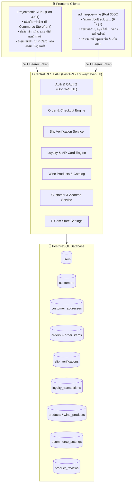

# 🍷 Master API Specification & Implementation Plan
## The Bottle Club (e-Commerce) & Admin POS Wine Central REST API

> **เอกสารแผนแม่บทระบบ API (Unified Master API Plan)**  
> จัดทำขึ้นเพื่อให้ทีม Backend Developer นำไปพัฒนา REST API ให้สมบูรณ์แบบครบถ้วนทุกโมดูลใน Sprint เดียว  
> ครอบคลุมการเชื่อมต่อระหว่าง **ProjectbottleClub1** (Client Storefront :3001) และ **admin-pos-wine** (Backoffice :3000)  
> ทำงานร่วมกับ FastAPI (`https://api.wayneven.uk`) โดยตรง **ไม่ใช้งาน Supabase**

---

## 📑 สารบัญ (Table of Contents)
1. [สถาปัตยกรรมระบบและความสัมพันธ์ (System Architecture)](#1-สถาปัตยกรรมระบบ)
2. [โครงสร้างฐานข้อมูล & Migrations (Database Schema)](#2-โครงสร้างฐานข้อมูล-ddl)
3. [ตารางสรุป Endpoint ทั้งหมด (Consolidated Endpoint Matrix)](#3-ตารางสรุป-endpoint-ทั้งหมด)
4. [รายละเอียด API แยกตามโมดูล (Detailed API Specifications)](#4-รายละเอียด-api-แยกตามโมดูล)
   - [Module 1: Dashboard Web Wine](#module-1-dashboard-web-wine)
   - [Module 2: โปรโมชั่น & คูปอง (Promotions & Coupons)](#module-2-จัดการโปรโมชั่น-web-wine)
   - [Module 3: คำสั่งซื้อออนไลน์ & Checkout (Orders & Tracking)](#module-3-คำสั่งซื้อออนไลน์-e-com-orders)
   - [Module 4: ตรวจสอบสลิปโอนเงิน (Slip Verification & Payment)](#module-4-ตรวจสอบสลิปโอนเงิน-payments)
   - [Module 5: จัดการข้อมูลไวน์ (Wine Catalog & Stock)](#module-5-จัดการสินค้า-web-wine)
   - [Module 6: สมาชิก & แต้มสะสม VIP (Members & Loyalty Points)](#module-6-สมาชิก--แต้มสะสม-loyalty-crm)
   - [Module 7: รีวิวไวน์จากลูกค้า (Customer Reviews Moderation)](#module-7-รีวิวไวน์จากลูกค้า-reviews)
   - [Module 8: รายงานยอดขาย e-Commerce (Sales Reports)](#module-8-รายงานยอดขาย-e-commerce)
   - [Module 9: ตั้งค่าร้านค้าออนไลน์ (Store Settings)](#module-9-ตั้งค่าร้านค้า-e-com-settings)
   - [Module 10: ระบบสมาชิก ลูกค้า และ Social Login (LINE & Google)](#module-10-social-login--customer-account-sync)
5. [Business Logic & Auto-Triggers อัตโนมัติ](#5-business-logic--auto-triggers)
6. [ลำดับการพัฒนางาน Backend (Implementation Checklist)](#6-ลำดับการทำงานของ-backend-developer)

---

## 1. สถาปัตยกรรมระบบ (System Architecture)



### หลักการสำคัญ (Core Principles):
1. **แยกประเภทคำสั่งซื้อด้วย `order_source`:**
   - หน้าร้าน POS: `order_source = 'pos'`
   - เว็บไซต์ The Bottle Club: `order_source = 'ecommerce'`
   - ห้ามไม่ให้ข้อมูล e-Commerce ไปปะปนกับกะแคชเชียร์ (Shifts) ของ POS หน้าร้าน
2. **ระบบสมาชิกสองฝั่งเชื่อมโยงกัน (User $\leftrightarrow$ Customer):**
   - เมื่อสมัครสมาชิก หรือ Login ผ่าน Google/LINE จะต้องมีข้อมูลในตาราง `users` (Auth) และ `customers` (CRM & Loyalty) เสมอ
   - อีเมล (`email`) หรือ เบอร์โทร (`phone`) เป็น Key ในการจับคู่
3. **ความปลอดภัย:**
   - ห้ามนำ `JWT_SECRET_KEY` หรือ Database Connection String ส่งให้ Client Frontend
   - ทุก API ที่ต้องยืนยันตัวตน ต้องส่ง Header `Authorization: Bearer <access_token>`

---

## 2. โครงสร้างฐานข้อมูล DDL (Database Schema)

รันคำสั่ง SQL ด้านล่างนี้บน PostgreSQL ของ Backend เพื่อสร้างตารางและคอลัมน์ที่จำเป็นสำหรับระบบ e-Commerce:

```sql
-- 1. เพิ่มคอลัมน์ order_source ในตาราง orders (หากยังไม่มี)
ALTER TABLE orders ADD COLUMN IF NOT EXISTS order_source VARCHAR(20) DEFAULT 'pos'; -- 'pos' หรือ 'ecommerce'
ALTER TABLE orders ADD COLUMN IF NOT EXISTS shipping_address_id INTEGER;
ALTER TABLE orders ADD COLUMN IF NOT EXISTS shipping_fee NUMERIC(10,2) DEFAULT 0.00;
ALTER TABLE orders ADD COLUMN IF NOT EXISTS tracking_number VARCHAR(100);
ALTER TABLE orders ADD COLUMN IF NOT EXISTS carrier_name VARCHAR(100);
ALTER TABLE orders ADD COLUMN IF NOT EXISTS slip_url TEXT;
ALTER TABLE orders ADD COLUMN IF NOT EXISTS slip_verified BOOLEAN DEFAULT FALSE;

-- 2. ตารางที่อยู่ลูกค้า (Customer Addresses)
CREATE TABLE IF NOT EXISTS customer_addresses (
    id SERIAL PRIMARY KEY,
    customer_id INTEGER REFERENCES customers(id) ON DELETE CASCADE,
    recipient_name VARCHAR(255) NOT NULL,
    phone VARCHAR(50),
    address_line TEXT NOT NULL,
    subdistrict VARCHAR(255),
    district VARCHAR(255),
    province VARCHAR(255),
    postal_code VARCHAR(20),
    country VARCHAR(100) DEFAULT 'Thailand',
    is_default BOOLEAN DEFAULT FALSE,
    created_at TIMESTAMP WITH TIME ZONE DEFAULT CURRENT_TIMESTAMP,
    updated_at TIMESTAMP WITH TIME ZONE DEFAULT CURRENT_TIMESTAMP
);

-- 3. ตารางตรวจสอบสลิปโอนเงิน (Slip Verifications)
CREATE TABLE IF NOT EXISTS slip_verifications (
    id SERIAL PRIMARY KEY,
    order_id INTEGER REFERENCES orders(id) ON DELETE CASCADE,
    customer_id INTEGER REFERENCES customers(id) ON DELETE SET NULL,
    image_url TEXT NOT NULL,
    transfer_amount NUMERIC(10,2) NOT NULL,
    transfer_date DATE NOT NULL,
    transfer_time TIME NOT NULL,
    bank_name VARCHAR(100) NOT NULL,
    status VARCHAR(30) DEFAULT 'pending', -- 'pending', 'approved', 'rejected'
    admin_note TEXT,
    verified_by_user_id INTEGER REFERENCES users(id) ON DELETE SET NULL,
    verified_at TIMESTAMP WITH TIME ZONE,
    created_at TIMESTAMP WITH TIME ZONE DEFAULT CURRENT_TIMESTAMP
);

-- 4. ตารางประวัติแต้มสะสม Loyalty (Loyalty Transactions)
CREATE TABLE IF NOT EXISTS loyalty_transactions (
    id SERIAL PRIMARY KEY,
    customer_id INTEGER NOT NULL REFERENCES customers(id) ON DELETE CASCADE,
    order_id INTEGER REFERENCES orders(id) ON DELETE SET NULL,
    type VARCHAR(20) NOT NULL, -- 'earn', 'redeem', 'adjust', 'expire'
    points INTEGER NOT NULL,
    balance_after INTEGER NOT NULL,
    description TEXT,
    created_at TIMESTAMP WITH TIME ZONE DEFAULT CURRENT_TIMESTAMP
);

-- 5. ตารางรีวิวไวน์จากลูกค้า (Product Reviews)
CREATE TABLE IF NOT EXISTS product_reviews (
    id SERIAL PRIMARY KEY,
    product_id INTEGER NOT NULL,
    customer_id INTEGER REFERENCES customers(id) ON DELETE SET NULL,
    customer_name VARCHAR(255) NOT NULL,
    rating INTEGER CHECK (rating >= 1 AND rating <= 5),
    comment TEXT,
    status VARCHAR(20) DEFAULT 'pending', -- 'approved', 'pending', 'rejected'
    created_at TIMESTAMP WITH TIME ZONE DEFAULT CURRENT_TIMESTAMP
);

-- 6. ตารางตั้งค่าร้านค้า e-Commerce (Store Settings)
CREATE TABLE IF NOT EXISTS ecommerce_settings (
    id SERIAL PRIMARY KEY,
    key VARCHAR(100) UNIQUE NOT NULL,
    value JSONB NOT NULL,
    updated_at TIMESTAMP WITH TIME ZONE DEFAULT CURRENT_TIMESTAMP
);

-- เพิ่มค่าเริ่มต้นสำหรับการตั้งค่าร้านค้า
INSERT INTO ecommerce_settings (key, value) VALUES
('shipping', '{"standard_fee": 120, "free_shipping_threshold": 2500, "cod_available": true}'::jsonb),
('bank_account', '{"bank_name": "KBANK", "account_name": "บริษัท เดอะ บอทเทิล คลับ จำกัด", "account_number": "123-4-56789-0", "promptpay_id": "0105566000000"}'::jsonb),
('loyalty_rules', '{"earn_rate_thb": 100, "earn_points": 1, "redeem_points": 10, "redeem_discount_thb": 1, "welcome_points": 50}'::jsonb)
ON CONFLICT (key) DO NOTHING;
```

---

## 3. ตารางสรุป Endpoint ทั้งหมด (Consolidated Endpoint Matrix)

| โมดูล | Method | Path | หน้าบ้านที่เรียกใช้งาน | สถานะ |
| :--- | :--- | :--- | :--- | :--- |
| **Auth** | `POST` | `/api/v1/auth/login` | หน้าร้าน & Admin Login | มีแล้ว |
| **Auth** | `POST` | `/api/v1/auth/register` | หน้าร้าน `/register` | มีแล้ว |
| **Auth** | `GET` | `/api/v1/auth/me` | ตรวจสอบ Session ผู้ใช้ | มีแล้ว |
| **Auth** | `GET` | `/api/v1/auth/oauth/google` | ล็อกอิน Google | **ต้องทำเพิ่ม** |
| **Auth** | `GET` | `/api/v1/auth/oauth/line` | ล็อกอิน LINE | **ต้องทำเพิ่ม** |
| **Module 1: Dashboard** | `GET` | `/api/v1/reports/ecommerce/dashboard` | Admin `/admin/bottleclub` | **ต้องทำเพิ่ม** |
| **Module 2: Promotions**| `GET` | `/api/v1/promotions/ecommerce` | หน้าร้าน `/` แบนเนอร์ | มี/ปรับแต่ง |
| **Module 2: Coupons**   | `POST` | `/api/v1/promotions/coupons/validate`| หน้าร้าน `/checkout` | มีแล้ว |
| **Module 3: Orders**    | `POST` | `/api/v1/orders/ecommerce` | หน้าร้าน `/checkout` | **ต้องทำเพิ่ม/ต่อยอด** |
| **Module 3: Orders**    | `GET` | `/api/v1/orders/?order_source=ecommerce` | Admin `/admin/bottleclub/orders` | ต่อยอด Param |
| **Module 3: Tracking**  | `PUT` | `/api/v1/orders/{id}/tracking` | Admin เพิ่มเลขพัสดุ | **ต้องทำเพิ่ม** |
| **Module 3: Tracking**  | `GET` | `/api/v1/orders/track/{tracking_or_ref}` | หน้าร้าน `/tracking` | **ต้องทำเพิ่ม** |
| **Module 4: Payments**  | `POST` | `/api/v1/slip-verify/upload` | หน้าร้าน แจ้งโอนเงิน | **ต้องทำเพิ่ม** |
| **Module 4: Payments**  | `GET` | `/api/v1/slip-verify/list` | Admin ตรวจสอบสลิป | **ต้องทำเพิ่ม** |
| **Module 4: Payments**  | `POST` | `/api/v1/slip-verify/{id}/approve` | Admin อนุมัติสลิป & ตัดแต้ม | **ต้องทำเพิ่ม** |
| **Module 4: Payments**  | `POST` | `/api/v1/slip-verify/{id}/reject` | Admin ไม่อนุมัติสลิป | **ต้องทำเพิ่ม** |
| **Module 5: Products**  | `GET` | `/api/v1/wine-products/` | หน้าร้าน `/product` (7,622 ไวน์) | มีแล้ว |
| **Module 5: Products**  | `GET` | `/api/v1/wine-products/{id}` | หน้าร้าน `/product/[id]` | มีแล้ว |
| **Module 5: Products**  | `PUT` | `/api/v1/wine-products/{id}` | Admin แก้ไขข้อมูลไวน์ | **ต้องทำเพิ่ม** |
| **Module 6: Members**   | `GET` | `/api/v1/customers/` | Admin `/admin/bottleclub/members`| มีแล้ว |
| **Module 6: Members**   | `PUT` | `/api/v1/customers/{id}` | หน้าร้าน `/account/profile` | มีแล้ว |
| **Module 6: Addresses** | `GET` | `/api/v1/customer-addresses/customer/{id}`| หน้าร้าน `/account/addresses`| มีแล้ว |
| **Module 6: Addresses** | `POST` | `/api/v1/customer-addresses/` | หน้าร้าน เพิ่มที่อยู่จัดส่ง | มีแล้ว |
| **Module 6: Loyalty**   | `GET` | `/api/v1/loyalty/balance/{customer_id}` | หน้าร้าน `/account` (VIP Card) | มีแล้ว |
| **Module 6: Loyalty**   | `GET` | `/api/v1/loyalty/transactions/{customer_id}` | หน้าร้าน `/account/points` | มีแล้ว |
| **Module 6: Loyalty**   | `POST` | `/api/v1/loyalty/earn` | ระบบคำนวณแต้มเมื่อจ่ายสำเร็จ | มีแล้ว |
| **Module 7: Reviews**   | `GET` | `/api/v1/reviews/product/{product_id}` | หน้าร้าน หน้าสินค้า | มีแล้ว/ปรับแต่ง |
| **Module 7: Reviews**   | `POST` | `/api/v1/reviews/` | หน้าร้าน เขียนรีวิว | มีแล้ว |
| **Module 7: Reviews**   | `PUT` | `/api/v1/reviews/{id}/moderate` | Admin อนุมัติ/ซ่อนรีวิว | **ต้องทำเพิ่ม** |
| **Module 8: Reports**   | `GET` | `/api/v1/reports/sales?order_source=ecommerce` | Admin `/admin/bottleclub/reports` | ต่อยอด Param |
| **Module 9: Settings**  | `GET` | `/api/v1/settings/ecommerce` | ดึงค่าส่ง, บัญชีธนาคาร, อัตราแต้ม | **ต้องทำเพิ่ม** |
| **Module 9: Settings**  | `PUT` | `/api/v1/settings/ecommerce` | Admin บันทึกตั้งค่าร้านค้า | **ต้องทำเพิ่ม** |

---

## 4. รายละเอียด API แยกตามโมดูล (Detailed API Specifications)

### Module 1: Dashboard Web Wine
**Path:** `GET /api/v1/reports/ecommerce/dashboard`  
**วัตถุประสงค์:** แสดงตัวเลขสรุปแดชบอร์ดของ The Bottle Club ในหน้า Admin (`/admin/bottleclub`)

**Response (200 OK):**
```json
{
  "status": "success",
  "data": {
    "sales_today": 48900.00,
    "sales_this_month": 1285000.00,
    "pending_orders_count": 8,
    "pending_slips_count": 5,
    "total_members": 1420,
    "recent_orders": [
      {
        "id": 1082,
        "order_number": "BC-2026-1082",
        "customer_name": "สมชาย ไวน์เลิฟเวอร์",
        "total_amount": 6890.00,
        "status": "pending_slip",
        "payment_method": "transfer",
        "created_at": "2026-10-02T14:30:00Z"
      }
    ],
    "top_selling_wines": [
      { "id": 2353, "name": "Muscat Frontignan Premier", "sold_bottles": 48 }
    ]
  }
}
```

---

### Module 2: จัดการโปรโมชั่น Web Wine
**Path:** `POST /api/v1/promotions/coupons/validate`  
**Request Body:**
```json
{
  "code": "WINEVIP2026",
  "subtotal": 3500.00,
  "customer_id": 12
}
```
**Response (200 OK):**
```json
{
  "valid": true,
  "code": "WINEVIP2026",
  "discount_type": "percentage",
  "discount_value": 10.0,
  "discount_amount": 350.00,
  "final_total": 3150.00,
  "message": "โค้ดส่วนลด 10% ถูกใช้งานสำเร็จ"
}
```

---

### Module 3: คำสั่งซื้อออนไลน์ (e-Com Orders)
**Path:** `POST /api/v1/orders/ecommerce`  
**วัตถุประสงค์:** สร้างคำสั่งซื้อออนไลน์จากหน้าเว็บ `/checkout`

**Request Body:**
```json
{
  "customer_id": 12,
  "recipient_name": "กานต์ธิดา ศิริโรจน์",
  "recipient_phone": "0819876543",
  "shipping_address": "88/12 อาคารไวน์ การ์เด้นท์ ถ.สุขุมวิท 55 แขวงคลองตันเหนือ เขตวัฒนา กรุงเทพฯ 10110",
  "delivery_note": "ฝากไว้ที่นิติบุคคลคอนโดได้เลยค่ะ",
  "payment_method": "transfer",
  "order_source": "ecommerce",
  "coupon_code": "WINEVIP2026",
  "shipping_fee": 0.00,
  "items": [
    {
      "product_id": 2353,
      "quantity": 2,
      "unit_price": 1559.00
    },
    {
      "product_id": 104,
      "quantity": 1,
      "unit_price": 2890.00
    }
  ]
}
```

**Response (201 Created):**
```json
{
  "id": 1083,
  "order_number": "BC-2026-1083",
  "subtotal": 6008.00,
  "discount_amount": 350.00,
  "shipping_fee": 0.00,
  "total_amount": 5658.00,
  "status": "pending_slip",
  "payment_method": "transfer",
  "created_at": "2026-10-02T16:45:00Z"
}
```

#### การอัปเดตเลขพัสดุ (Admin)
**Path:** `PUT /api/v1/orders/{order_id}/tracking`  
**Request Body:**
```json
{
  "carrier_name": "Kerry Express (Cool Delivery)",
  "tracking_number": "KEX-99887766TH"
}
```

---

### Module 4: ตรวจสอบสลิปโอนเงิน (Payments)
**Path:** `POST /api/v1/slip-verify/upload` (`multipart/form-data`)  
**วัตถุประสงค์:** หน้า `/account/confirm-payment` แนบหลักฐานการโอนเงิน

**Form Fields:**
- `order_id`: 1083 (integer)
- `transfer_amount`: 5658.00 (float)
- `transfer_date`: "2026-10-02"
- `transfer_time`: "16:50"
- `bank_name`: "KBANK"
- `slip_file`: ไฟล์รูปภาพ (.jpg, .png)

**Path:** `POST /api/v1/slip-verify/{slip_id}/approve`  
**วัตถุประสงค์:** Admin กดอนุมัติสลิปในหน้า `/admin/bottleclub/payments`  
**สิ่งที่ระบบต้องทำอัตโนมัติ (Automated Actions):**
1. เปลี่ยนสถานะสลิปเป็น `approved`
2. เปลี่ยนสถานะออเดอร์เป็น `paid`
3. ตัดสต็อกสินค้าในคลัง
4. คำนวณแต้มสะสม: `total_amount / 100` $\rightarrow$ เพิ่มแต้มเข้าบัญชีลูกค้า `POST /api/v1/loyalty/earn`

---

### Module 5: จัดการสินค้า Web Wine
**Path:** `GET /api/v1/wine-products/` (มีอยู่แล้ว)  
**Query Parameters:**
- `page`: 1
- `per_page`: 20
- `search`: ค้นหาชื่อไวน์ หรือ ผู้ผลิต
- `wine_style`: red, white, sparkling, rose, dessert
- `country`: FR, IT, ES, US, AU, CL
- `sort_by`: price_asc, price_desc, vintage_desc, rating_desc

**Path:** `PUT /api/v1/wine-products/{id}` (สำหรับ Admin แก้ไขข้อมูลไวน์)  
**Request Body:**
```json
{
  "name": "1L Muscat Frontignan Premier",
  "price": 1559.00,
  "cost_price": 950.00,
  "quantity": "1L",
  "alcohol": "12.5%",
  "vintage": "2019",
  "grape_variety": "Muscat Blanc à Petits Grains",
  "country": "FR",
  "region": "France / Frontignan",
  "in_stock": 43,
  "description": "ไวน์หวานหอมกลิ่นดอกไม้และผลไม้เมืองร้อน รสชาตินุ่มละมุน...",
  "is_active": true
}
```

---

### Module 6: สมาชิก & แต้มสะสม (Loyalty & CRM)

#### 1. การดูคะแนนสะสมและการ์ด VIP
**Path:** `GET /api/v1/loyalty/balance/{customer_id}`  
**Response (200 OK):**
```json
{
  "customer_id": 12,
  "customer_name": "กานต์ธิดา ศิริโรจน์",
  "balance": 1850,
  "tier": "GOLD VIP",
  "member_code": "BC-0012",
  "pending_expiring": 0
}
```

#### เกณฑ์คำนวณระดับ VIP Tier (Loyalty Tiers):
- **CLASSIC LEVEL:** 0 – 499 PTS
- **SILVER LEVEL:** 500 – 1,999 PTS
- **GOLD VIP:** 2,000 – 4,999 PTS
- **PLATINUM LEVEL:** 5,000 – 9,999 PTS
- **DIAMOND VIP:** 10,000+ PTS

#### 2. ดูประวัติแต้มสะสม
**Path:** `GET /api/v1/loyalty/transactions/{customer_id}`  
**Response (200 OK):**
```json
{
  "data": [
    {
      "id": 84,
      "date": "2026-10-02T16:55:00Z",
      "type": "earn",
      "points": 56,
      "description": "ได้รับแต้มจากการสั่งซื้อคำสั่งซื้อ #BC-2026-1083",
      "balance_after": 1850
    },
    {
      "id": 12,
      "date": "2026-09-15T10:00:00Z",
      "type": "earn",
      "points": 50,
      "description": "โบนัสแต้มต้อนรับสมาชิกใหม่ (Welcome Bonus)",
      "balance_after": 50
    }
  ]
}
```

#### 3. จัดการที่อยู่ลูกค้า (Customer Addresses)
**Path:** `POST /api/v1/customer-addresses/`  
**Request Body:**
```json
{
  "customer_id": 12,
  "recipient_name": "กานต์ธิดา ศิริโรจน์",
  "phone": "0819876543",
  "address_line": "88/12 อาคารไวน์ การ์เด้นท์ ถ.สุขุมวิท 55",
  "subdistrict": "คลองตันเหนือ",
  "district": "วัฒนา",
  "province": "กรุงเทพมหานคร",
  "postal_code": "10110",
  "is_default": true
}
```

#### 4. อัปเดตข้อมูลส่วนตัว (Profile Update)
**Path:** `PUT /api/v1/customers/{customer_id}`  
**Request Body:**
```json
{
  "first_name": "กานต์ธิดา",
  "last_name": "ศิริโรจน์พิบูล",
  "phone": "0819876543",
  "email": "customer@bottleclub.com"
}
```
*หมายเหตุ: เมื่ออัปเดตแล้ว ข้อมูลในหน้า Admin (`/admin/bottleclub/members`) จะอัปเดตตามทันที*

---

### Module 7: รีวิวไวน์จากลูกค้า (Reviews)
**Path:** `GET /api/v1/reviews/product/{product_id}`  
**Path:** `PUT /api/v1/reviews/{review_id}/moderate` (Admin อนุมัติ/ซ่อนรีวิว)  
**Request Body:**
```json
{
  "status": "approved" // 'approved', 'rejected'
}
```

---

### Module 8: รายงานยอดขาย e-Commerce
**Path:** `GET /api/v1/reports/sales?order_source=ecommerce`  
**Query Parameters:**
- `date_from`: "2026-10-01"
- `date_to`: "2026-10-31"
- `group_by`: "day" // 'day', 'month', 'year'

---

### Module 9: ตั้งค่าร้านค้า (e-Com Settings)
**Path:** `GET /api/v1/settings/ecommerce`  
**Path:** `PUT /api/v1/settings/ecommerce`  
**Response / Request JSON:**
```json
{
  "shipping": {
    "standard_fee": 120.00,
    "free_shipping_threshold": 2500.00,
    "express_delivery_available": true
  },
  "bank_account": {
    "bank_name": "ธนาคารกสิกรไทย (KBANK)",
    "account_name": "บริษัท เดอะ บอทเทิล คลับ จำกัด",
    "account_number": "123-4-56789-0",
    "promptpay_id": "0105566000000"
  },
  "loyalty_rules": {
    "earn_rate_thb": 100,
    "earn_points": 1,
    "welcome_bonus_points": 50
  }
}
```

---

### Module 10: Social Login & Customer Account Sync

#### LINE & Google OAuth2 Flow:
1. ผู้ใช้คลิกปุ่ม "เข้าสู่ระบบด้วย LINE" หรือ "เข้าสู่ระบบด้วย Google"
2. หน้าเว็บ Redirect ไปยัง:
   - `GET /api/v1/auth/oauth/google?redirect_uri=http://localhost:3001/auth/success`
   - `GET /api/v1/auth/oauth/line?redirect_uri=http://localhost:3001/auth/success`
3. Backend ตรวจสอบ ID Token กับ Google / LINE:
   - ดึง `email`, `name`, `picture`, `sub`
4. Backend ค้นหาในฐานข้อมูล:
   - หากผู้ใช้ยังไม่มีบัญชี $\rightarrow$ สร้างใน `users` และสร้างใน `customers`
   - ให้แต้มต้อนรับ **50 PTS** ฟรีทันที
5. Backend ออก JWT Access Token และ Redirect กลับมาที่:
   - `http://localhost:3001/auth/success?token=<JWT_TOKEN>`

---

## 5. Business Logic & Auto-Triggers

| เหตุการณ์ (Event) | การประมวลผลอัตโนมัติ (Automated Trigger) |
| :--- | :--- |
| **ลูกค้าสมัครสมาชิกใหม่ (Register / Google / LINE)** | 1. สร้าง Record ในตาราง `users`<br/>2. สร้าง Record ในตาราง `customers`<br/>3. เพิ่มประวัติแต้มต้อนรับ 50 แต้ม ใน `loyalty_transactions` |
| **ลูกค้ากดยืนยันสั่งซื้อ (Checkout)** | 1. สร้างออเดอร์ใน `orders` ด้วย `order_source = 'ecommerce'`<br/>2. หากมีคูปอง ทำการบันทึกส่วนลด |
| **ลูกค้าแจ้งโอนเงิน (Upload Slip)** | 1. บันทึกสลิปใน `slip_verifications` สถานะ `pending`<br/>2. อัปเดต `orders.status = 'pending_approval'` |
| **Admin อนุมัติสลิป (Approve Slip)** | 1. อัปเดตสลิปเป็น `approved`<br/>2. อัปเดตออเดอร์เป็น `paid`<br/>3. ลดสต็อกไวน์ใน `wine_products.in_stock`<br/>4. คำนวณแต้ม `total_amount / 100` บันทึกลง `loyalty_transactions` |
| **ลูกค้าแก้ไขโปรไฟล์ (Update Profile)** | 1. อัปเดต `customers`<br/>2. อัปเดต `users`<br/>3. แสดงผลทันทีใน Admin `/admin/bottleclub/members` |
| **ลูกค้าเพิ่มที่อยู่ใหม่ (Add Address)** | 1. บันทึกลง `customer_addresses`<br/>2. อัปเดต Default Address ของลูกค้า |

---

## 6. ลำดับการทำงานของ Backend Developer (Implementation Checklist)

- [ ] **Step 1: Database Migration**
  - รันคำสั่ง SQL DDL ในส่วนที่ 2 (เพิ่มคอลัมน์ `order_source`, สร้างตาราง `slip_verifications`, `ecommerce_settings`, `customer_addresses`, `loyalty_transactions`)
- [ ] **Step 2: Social OAuth Handlers (LINE & Google)**
  - เพิ่มเส้นทาง `/api/v1/auth/oauth/line` และ `/api/v1/auth/oauth/google`
  - ตรวจสอบให้แน่ใจว่า Auto-Sync ไปยังตาราง `customers` ด้วย
- [ ] **Step 3: Slip Verification Endpoints**
  - สร้าง `POST /api/v1/slip-verify/upload` รับไฟล์รูปภาพ
  - สร้าง `POST /api/v1/slip-verify/{id}/approve` ผูกเข้ากับระบบตัดสต็อกและเพิ่มแต้ม Loyalty อัตโนมัติ
- [ ] **Step 4: E-Commerce Orders & Settings**
  - เพิ่ม Endpoint `POST /api/v1/orders/ecommerce` และ `GET /api/v1/settings/ecommerce`
  - กรองออเดอร์ในหน้า Admin ด้วย Query Param `order_source=ecommerce`
- [ ] **Step 5: Customer Address & Profile Sync**
  - รองรับ `GET /api/v1/customer-addresses/customer/{id}` และ `POST /api/v1/customer-addresses/`
  - ให้ `PUT /api/v1/customers/{id}` อัปเดตชื่อ-เบอร์โทรที่สะท้อนมายังหน้า Admin สมาชิก
- [ ] **Step 6: Dashboard & Reports API**
  - สร้าง `GET /api/v1/reports/ecommerce/dashboard` รวมข้อมูลยอดขายออนไลน์สำหรับหน้าแรกของ Admin
